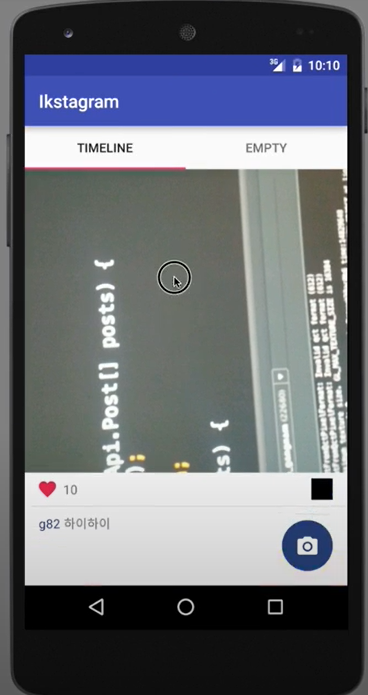

# studyAndroid
---
##### study android project
강의를 통한 안드로이드 클론 코딩 입니다
---
##### 학습자료
> [겜팔이의 안드로이드 세뇌교실 - 인★그램 개발부터 배포까지](https://www.inflearn.com/course/%EC%95%88%EB%93%9C%EB%A1%9C%EC%9D%B4%EB%93%9C-%EC%84%B8%EB%87%8C%EA%B5%90%EC%8B%A4#description)
> > 강의소개 : 안드로이드 세뇌교실을 통해 어플리케이션 개발 / 발매 / 업데이트의 과정을 한 번에 배워보세요. JAVA의 기초를 배우고 안드로이드 앱을 실제로 구축하면서 배포 및 업데이트 과정까지 알려드려요. 실습을 통해 인★그램의 핵심적인 기능을 직접 구현해보세요. 프로그래밍을 몰라도 시작할 수 있습니다.
   [깃허브](https://github.com/g82/Anstagram)
---
+ 목차
1. TableActivity
1. IrenGlide
1. fragment
1. RecyclerView
1. AsyncTask
1. ObjectAndCollections
1. Anstagram
---
개발화면   

